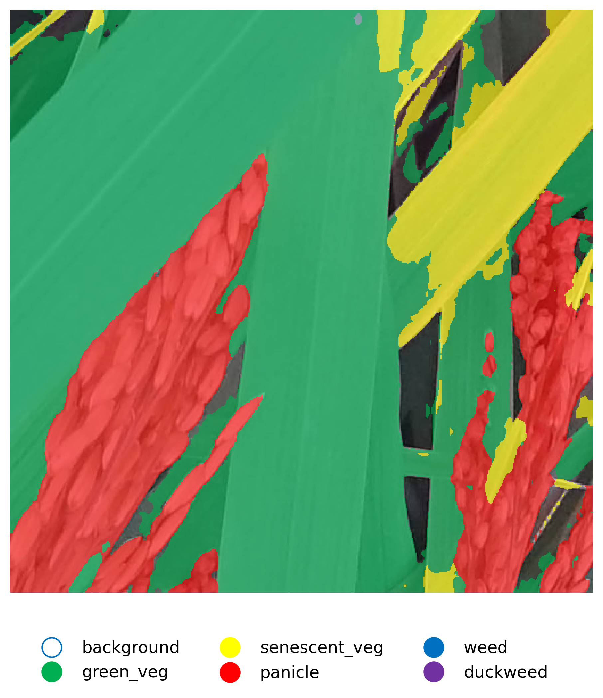

# RiceSEG Dataset Reproduction with SegFormer

本项目基于 MMSegmentation 框架，复现了《Global rice multiclass segmentation dataset (RiceSEG): comprehensive and diverse high-resolution RGB-annotated images for the development and benchmarking of rice segmentation algorithms》论文中的基准实验，使用了 SegFormer (Mit-b0) 模型。

---

## 1. 结果复现

部分复现结果图已放置于 `assets/compare` 和 `assets/pred_only` 文件夹下。

**原图、模型分割图、人工标注图对比：**


**模型分割图预测结果：**


---

## 2. 环境准备

请参考 MMSegmentation 官方文档安装 PyTorch 和 MMCV，然后克隆本项目并编译：

```bash
git clone [https://github.com/broucemonkey-stack/RiceSEG-Reproduction](https://github.com/broucemonkey-stack/RiceSEG-Reproduction)
cd mmsegmentation
pip install -v -e .
```

---

## 3. 数据准备

1. 请前往 [RiceSEG 数据集官网](https://www.global-rice.com/) 下载数据集。
2. 将数据集解压并组织成如下 MMSegmentation 标准格式，放入 `data/mmseg_format/` 目录下：

```text
data/
└── mmseg_format/
    ├── images/
    │   ├── train/
    │   └── val/
    └── masks/
        ├── train/
        └── val/
```

---

## 4. 训练模型命令

### 训练

```bash
python tools/train.py \
configs/_custom/segformer_mit-b0_8xb2-160k_ade20k-512x512.py \
--work-dir work_dirs/RiceSEG/train
```

### Tensorboard 监测

```bash
tensorboard --logdir work_dirs/RiceSEG/train --port 6006
```

### 测试

```bash
python tools/test.py \
work_dirs/RiceSEG/train/segformer_mit-b0_8xb2-160k_ade20k-512x512.py \
work_dirs/RiceSEG/train/iter_40000.pth \
--show-dir work_dirs/RiceSEG/val \
--work-dir work_dirs/RiceSEG/val
```

### 导出 Masks

```bash
python tools/export_masks.py \
work_dirs/RiceSEG/val/segformer_mit-b0_8xb2-160k_ade20k-512x512.py \
work_dirs/RiceSEG/train/iter_40000.pth \
--img-dir data/mmseg_format/images/test \
--out-dir work_dirs/RiceSEG/test
```

---

## 5. Mask 可视化

导出 mask 后，您可以运行以下代码对结果进行可视化处理：

```bash
python code/visualize_masks.py
```